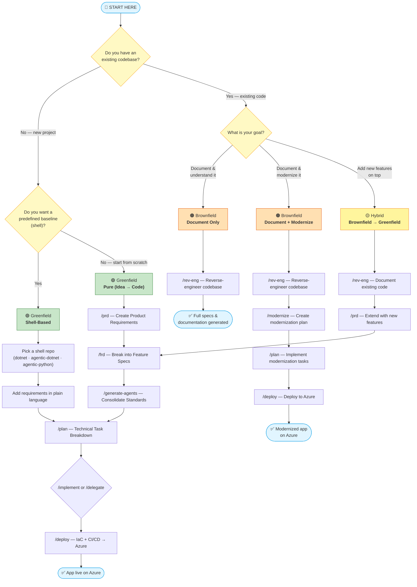

# Book tracking app

App developed using spec2cloud.

## Decision Flowchart

## Quick Reference Table

| Scenario | Workflow | Key Prompts | Outcome |
|---|---|---|---|
| Brand-new app from an idea | **Greenfield (Pure)** | `/prd` → `/frd` → `/generate-agents` → `/plan` → `/implement` or `/delegate` → `/deploy` | Production app on Azure |
| New app from a shell baseline | **Greenfield (Shell)** | Pick shell → add requirements → `/plan` → `/implement` → `/deploy` | Production app on Azure |
| Understand / document a codebase | **Brownfield (Doc)** | `/rev-eng` | Specs & docs |
| Document + modernize a codebase | **Brownfield (Modernize)** | `/rev-eng` → `/modernize` → `/plan` → `/deploy` | Modernized app on Azure |
| Existing codebase + new features | **Hybrid** | `/rev-eng` → `/prd` → `/frd` → `/plan` → `/implement` → `/deploy` | Extended app on Azure |

## Detailed Walkthroughs

### 🟢 Greenfield — Pure (Idea → Code)

> **You have**: a product idea or business problem  
> **You want**: a production-ready app deployed to Azure

| Step | Prompt | Agent | What happens |
|------|--------|-------|--------------|
| 1 | `/prd` | PM (`@pm`) | Conversational discovery → `specs/prd.md` |
| 2 | `/frd` | PM (`@pm`) | PRD decomposed into `specs/features/*.md` |
| 3 | `/generate-agents` | Dev Lead (`@dev-lead`) | Standards consolidated into `AGENTS.md` |
| 4 | `/plan` | Dev (`@dev`) | Features broken into `specs/tasks/*.md` |
| 5 | `/implement` **or** `/delegate` | Dev (`@dev`) | Code written locally **or** GitHub Issues assigned to Copilot Coding Agent |
| 6 | `/deploy` | Azure (`@azure`) | Bicep IaC + GitHub Actions → Azure |

### 🟢 Greenfield — Shell-Based

> **You have**: a known tech stack and architectural pattern  
> **You want**: a running baseline filled in with your requirements

1. **Pick a shell** that matches your target stack:
   - [shell-dotnet](https://github.com/EmeaAppGbb/shell-dotnet) — standard .NET
   - [agentic-shell-dotnet](https://github.com/EmeaAppGbb/agentic-shell-dotnet) — agentic .NET
   - [agentic-shell-python](https://github.com/EmeaAppGbb/agentic-shell-python) — agentic Python
2. **Add requirements** in plain language (or run `/prd` + `/frd`).
3. **Continue from `/plan`** onward — agents fill the gaps (endpoints, UI, storage, tests, deployment).

### 🟠 Brownfield — Document Only

> **You have**: an existing codebase with little or no documentation  
> **You want**: comprehensive specs and documentation

| Step | Prompt | Agent | What happens |
|------|--------|-------|--------------|
| 1 | `/rev-eng` | Tech Analyst (`@tech-analist`) | Read-only analysis → tasks, feature docs & product vision |

**Key rules**: the agent **never modifies code**, documents **only what exists**, and is **honest about gaps**.

### 🟠 Brownfield — Document + Modernize

> **You have**: a legacy codebase you want to bring up to modern standards  
> **You want**: a documented, modernized app deployed to Azure

| Step | Prompt | Agent | What happens |
|------|--------|-------|--------------|
| 1 | `/rev-eng` | Tech Analyst (`@tech-analist`) | Reverse-engineer existing code into specs |
| 2 | `/modernize` | Modernize (`@modernize`) | Modernization plan + risk assessment → `specs/modernize/` |
| 3 | `/plan` | Dev (`@dev`) | Implements modernization tasks from `specs/tasks/` |
| 4 | `/deploy` | Azure (`@azure`) | Bicep IaC + CI/CD → Azure |

### 🟡 Hybrid — Brownfield → Greenfield

> **You have**: an existing codebase **and** new feature ideas  
> **You want**: documented existing code extended with new capabilities

1. **`/rev-eng`** — Document the current state.
2. **`/prd`** — Define the new product vision that includes existing + new features.
3. **Continue the greenfield flow** from `/frd` onward — all new work is traceable back to specs.

## Common Use Cases Mapped to Workflows

| Use case | Recommended workflow |
|---|---|
| Hackathon / proof of concept | Greenfield (Pure) |
| Enterprise app with known patterns | Greenfield (Shell-Based) |
| New team onboarding to legacy system | Brownfield (Document Only) |
| Pre-acquisition technical due diligence | Brownfield (Document Only) |
| Migrate from on-prem to Azure | Brownfield (Document + Modernize) |
| Add AI features to existing SaaS product | Hybrid |
| Audit & compliance documentation | Brownfield (Document Only) |
| Knowledge preservation before team changes | Brownfield (Document Only) |
